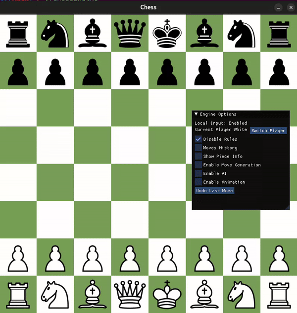

# Chess Engine

A **Chess Engine** implemented in C++, offering a comprehensive chess-playing experience with multiple game modes and smooth animations. The engine supports standard chess rules and is designed for both casual play and further development.



## Features

### Gameplay
- **Standard Chess Rules**:
  - Valid moves for all pieces.
  - Special moves: castling, en passant, and pawn promotion.
  - Check, checkmate, and stalemate detection.
- **Game Modes**:
  - Local multiplayer (two players on the same machine).
  - Online multiplayer (two players over a network).
  - Twitch chat mode (players make moves via chat commands).
  - Single-player (play against a computer opponent with a basic AI).

### Visuals & Interaction
- **Custom Animation Engine**: Smooth transitions for piece movement across the board.
- **Modular Input Handling**: Supports local inputs, online commands, and Twitch chat commands.
- **Interactive UI**: Built with **ImGui-SFML**, providing a clean and intuitive interface.

### Code Design
- **Extensible Structure**: Designed for adding new features, game modes, or chess variants.
- **Clear Separation**: Logic, input handling, rendering, and animations are modularized for clarity and maintainability.

## Code Overview

### Key Components
1. **`Engine` Class**:
   - Manages the game loop, piece interactions, and overall gameplay logic.

2. **`Board` and `Square` Classes**:
   - Represents the chessboard and its individual squares.

3. **`Piece` Class**:
   - Defines chess pieces and their movement rules.

4. **`Renderer` Class**:
   - Handles the visual rendering of the chessboard and pieces.

5. **`AnimationEngine` Class**:
   - Provides smooth animations for piece movements.

6. **`InputDispatcher` Class**:
   - Implements multiple input strategies (local, network, Twitch).

7. **`TextureFactory` Class**:
   - Manages textures for the chess pieces and board.

---

## Building the Project

### Prerequisites
- **C++17 Compiler**: GCC, Clang, or MSVC.
- **CMake**: Version 3.5 or later.
- **SFML**: For rendering and input handling.
- **ImGui-SFML**: For GUI integration.

### Build Instructions
1. Clone the repository:
   ```bash
   git clone https://github.com/yourusername/chess-engine.git
   cd chess-engine
   ```
2. Create a build directory:
   ```bash
   mkdir build && cd build
   ```
3. Configure the build with CMake:
   ```bash
   cmake ..
   ```
4. Compile the project:
   ```bash
   make
   ```
5. Run the executable:
   ```bash
   ./ChessEngine
   ```

---


---

## Future Plans

- **Advanced AI**: Implement a smarter opponent using Minimax with Alpha-Beta Pruning.
- **PGN Support**: Allow import and export of games for analysis.
- **Chess Variants**: Add support for popular variants like Chess960.
- **Enhanced UI**: Improve the user interface for a better experience.

---


## License

This project is licensed under the MIT License. See the `LICENSE` file for details.